<div align="center">

# 🚗 Car Features & MSRP Analysis

### *Uncovering What Drives the Price of a Car*

[](https://www.python.org/)
[](https://pandas.pydata.org/)
[](https://numpy.org/)
[](https://matplotlib.org/)
[](https://seaborn.pydata.org/)
[](https://jupyter.org/)

<br>

> 📊 **11,914 rows** &nbsp;|&nbsp; 🏷️ **16 Features** &nbsp;|&nbsp; 🏎️ **50+ Brands** &nbsp;|&nbsp; 📅 **1990 – 2017**

</div>

---

## 📌 Project Overview

This project performs a full end-to-end **Exploratory Data Analysis (EDA)** on a real-world automobile dataset. The goal is to understand how car features — such as engine horsepower, cylinder count, fuel type, and brand — influence the **Manufacturer's Suggested Retail Price (MSRP)**.

Whether you're a car enthusiast, a data analyst, or a recruiter looking for clean, structured analytical work — this project demonstrates every stage of the data science workflow.

---

## 🗂️ Dataset

| Field | Details |
|---|---|
| 📁 **Source File** | `data.csv` |
| 📦 **Total Records** | 11,914 entries |
| 📐 **Features** | 16 columns |
| 🏷️ **Target Variable** | `MSRP` (car price in USD) |
| 📅 **Year Range** | 1990 – 2017 |

### 🧾 Feature Summary

| # | Column | Type | Description |
|---|--------|------|-------------|
| 1 | `Make` | str | Car brand (e.g., BMW, Toyota) |
| 2 | `Model` | str | Car model name |
| 3 | `Year` | int | Manufacturing year |
| 4 | `Engine Fuel Type` | str | Type of fuel used |
| 5 | `Engine HP` | float | Horsepower of engine |
| 6 | `Engine Cylinders` | float | Number of cylinders |
| 7 | `Transmission Type` | str | Manual / Automatic |
| 8 | `Driven_Wheels` | str | FWD / RWD / AWD |
| 9 | `Number of Doors` | float | Door count |
| 10 | `Market Category` | str | Luxury, Performance, etc. |
| 11 | `Vehicle Size` | str | Compact / Midsize / Large |
| 12 | `Vehicle Style` | str | Sedan, SUV, Coupe, etc. |
| 13 | `highway MPG` | int | Highway fuel efficiency |
| 14 | `city mpg` | int | City fuel efficiency |
| 15 | `Popularity` | int | Popularity score |
| 16 | `MSRP` | int | 💰 Target: Retail price (USD) |

---

## 🔄 Project Workflow

```
┌─────────────────────────────────────────────────────────────────┐
│                    🚗 CAR MSRP ANALYSIS PIPELINE                │
└─────────────────────────────────────────────────────────────────┘
         │
         ▼
┌─────────────────┐
│  📥 Step 1      │  Import Libraries (pandas, numpy, matplotlib, seaborn)
│  Import Libs    │
└────────┬────────┘
         │
         ▼
┌─────────────────┐
│  📂 Step 2      │  Load Dataset → data.csv
│  Load Data      │  11,914 rows × 16 columns
└────────┬────────┘
         │
         ▼
┌─────────────────┐
│  🔍 Step 3      │  df.info() · df.describe()
│  Explore Data   │  Identify dtypes, ranges, stats
└────────┬────────┘
         │
         ▼
┌─────────────────┐
│  🩹 Step 4      │  Engine HP → fillna(mean)
│  Imputation     │  Engine Cylinders → fillna(mean)
│                 │  Market Category → fillna("Unknown")
└────────┬────────┘
         │
         ▼
┌─────────────────┐
│  🗑️ Step 5      │  Drop rows with null in:
│  Row Removal    │  Number of Doors · Engine Fuel Type
└────────┬────────┘
         │
         ▼
┌─────────────────┐
│  👯 Step 6–7    │  Found 715 duplicates → removed
│  Deduplication  │  Final: 0 duplicates remaining
└────────┬────────┘
         │
         ▼
┌─────────────────┐
│  🔄 Step 8      │  Year column: object → int64
│  Type Fix       │
└────────┬────────┘
         │
         ▼
┌──────────────────────────────────────────────────────────────┐
│  📊 Steps 9–16: Visualizations & Analysis                    │
│                                                              │
│  Bar Chart · Bar Chart · Line Chart · Scatter Plot          │
│  Pie Chart · Histogram · Heatmap · Filtered View            │
└────────┬─────────────────────────────────────────────────────┘
         │
         ▼
┌─────────────────┐
│  💾 Step 18     │  Export → cleaned_car_data.csv
│  Export CSV     │
└─────────────────┘
```

---

## 📊 Visualizations & Key Insights

### 🔬 Data Exploration Steps

| Step | Screenshot | Description |
|------|-----------|-------------|
| Step 1 | 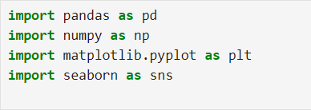 | Import Libraries |
| Step 2 | 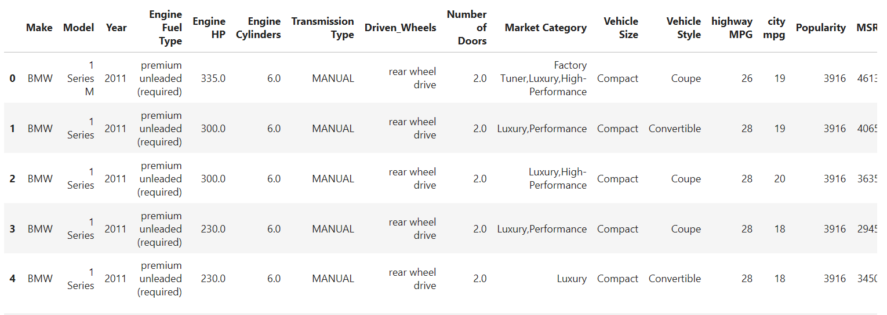 | Load Dataset — df.head() |
| Step 3 | 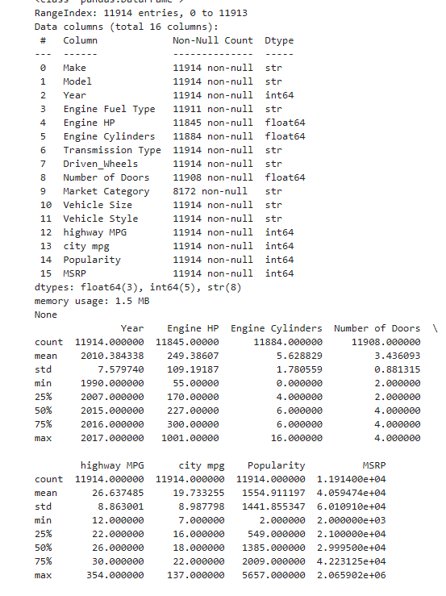 | df.info() + df.describe() |
| Step 4 | 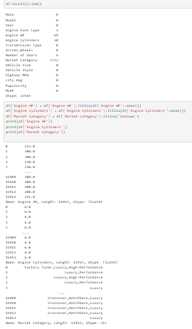 | Imputation Code |
| Step 5 | 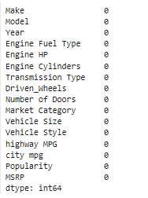 | Null Check (after imputation) |
| Step 6 | 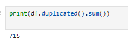 | Duplicate Count (715 found) |
| Step 7 | 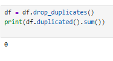 | Post-Dedup Check (0 remaining) |
| Step 8 | 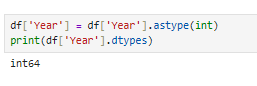 | Year dtype fix → int64 |

---

### 1️⃣ Top 10 Car Brands by Volume
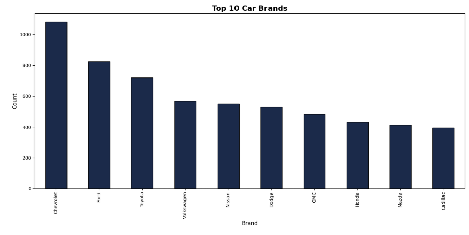

> 🏆 **Chevrolet** dominates with 1,000+ listings, followed by **Ford** and **Toyota**. These mainstream brands collectively represent the bulk of the market.

---

### 2️⃣ Average Price by Brand (Top 10 Most Expensive)
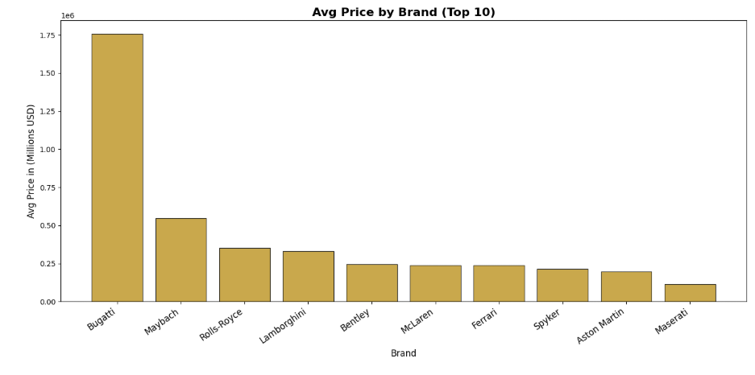

> 💎 **Bugatti** stands alone near $1.75M average MSRP — dwarfing all other brands. **Maybach**, **Rolls-Royce**, and **Lamborghini** follow, forming the true ultra-luxury tier.

---

### 3️⃣ Average Price Over Years (1990–2017)
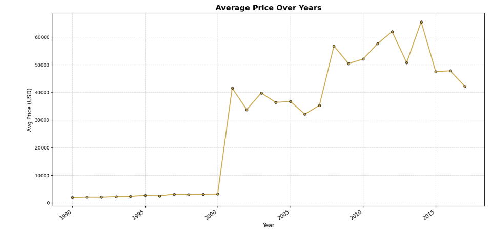

> 📈 Car prices remained flat until ~2001, then surged dramatically — reflecting the rise of luxury SUVs and high-performance vehicles entering the dataset.

---

### 4️⃣ Avg Engine HP vs. Avg MSRP by Cylinder Count
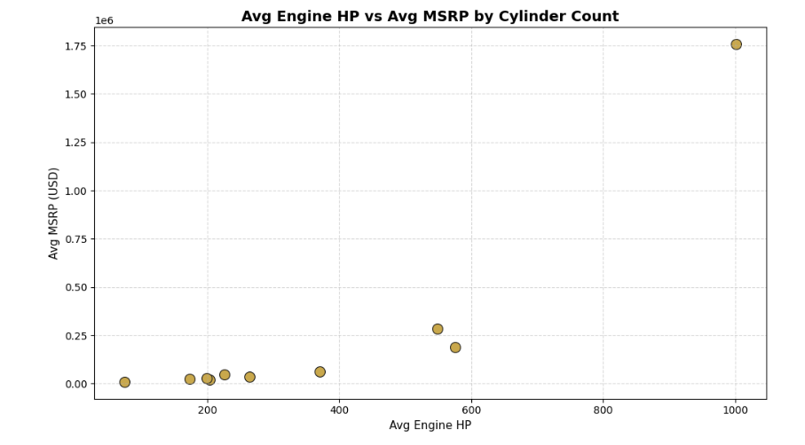

> ⚙️ Strong positive relationship: more cylinders → higher HP → higher MSRP. The top-right outlier (16-cylinder Bugatti) is a clear luxury extreme.

---

### 5️⃣ Fuel Type Distribution
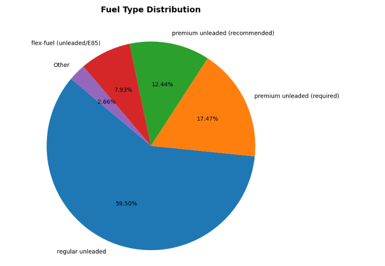

> ⛽ **Regular unleaded** accounts for ~59.5% of all vehicles. Premium unleaded (required + recommended) makes up nearly 30%, reflecting the significant luxury segment in this dataset.

---

### 6️⃣ MSRP Distribution
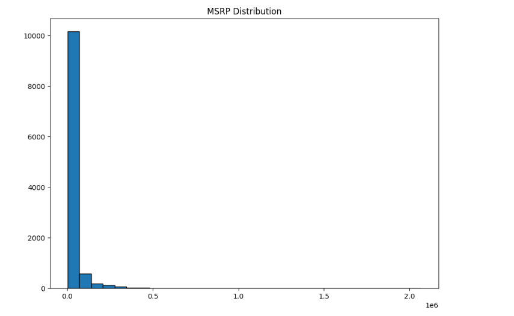

> 📉 Heavily **right-skewed** distribution — the vast majority of vehicles are priced under $100K, with a long tail of ultra-premium outliers stretching to $2M+.

---

### 7️⃣ Correlation Heatmap
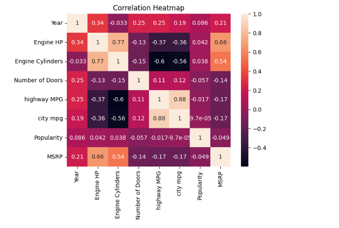

> 🔥 **Engine HP** (0.66) and **Engine Cylinders** (0.54) show the strongest positive correlation with MSRP. Fuel efficiency metrics (highway/city MPG) are negatively correlated with MSRP — more powerful = less efficient = more expensive.

---

### 8️⃣ Filtered Data — High-End Vehicles (MSRP > $50K)
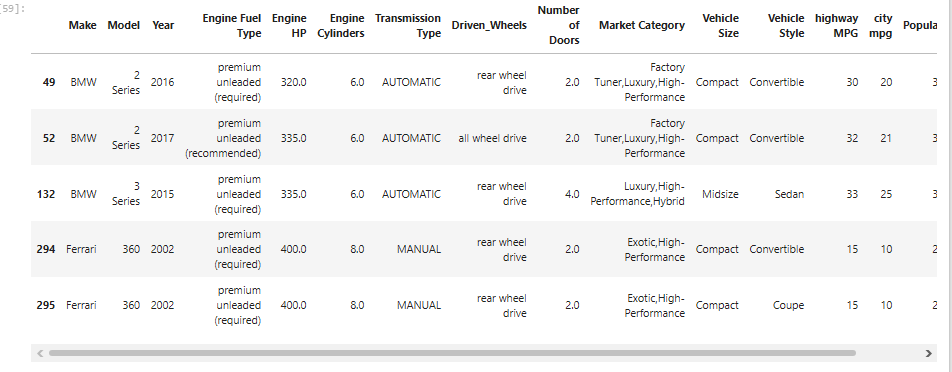

> 🎯 Filtering to premium vehicles (MSRP > $50K) isolates luxury and exotic brands, revealing the high-performance segment of the market.

---

## 🧹 Data Cleaning Summary

| Step | Issue Found | Action Taken |
|------|-------------|--------------|
| Missing: Engine HP | 69 nulls | Filled with **column mean** |
| Missing: Engine Cylinders | 30 nulls | Filled with **column mean** |
| Missing: Market Category | 3,742 nulls | Filled with `"Unknown"` |
| Missing: Number of Doors | 6 nulls | **Rows dropped** |
| Missing: Engine Fuel Type | 3 nulls | **Rows dropped** |
| Duplicate Rows | 715 found | **All removed** |
| Data Type: Year | Object dtype | Converted to **int64** |

---

## 💡 Key Findings

- 🏎️ **Engine HP is the #1 predictor of price** — correlation of 0.66 with MSRP
- 🔋 **Fuel efficiency decreases as price increases** — luxury cars prioritize power over economy
- 📅 **Post-2001 era saw massive price growth** — high-end models entered the market
- 🏷️ **Bugatti is a statistical outlier** — average price nearly 3× the next most expensive brand
- 🔢 **16-cylinder engines** command extreme premiums — limited to ultra-exotic models
- 🚗 **Chevrolet & Ford lead in volume**, but **Bugatti & Maybach lead in price**

---

## 📁 Repository Structure

```
📦 Data_Visualization/
 ┣ 📓 car_features_and_msrp_project.ipynb   ← Main analysis notebook
 ┣ 📄 data.csv                               ← Raw dataset
 ┣ 📄 cleaned_car_data.csv                  ← Cleaned & exported dataset
 ┣ 🖼️ s1.png   → Import Libraries
 ┣ 🖼️ s2.png   → df.head()
 ┣ 🖼️ s3.png   → df.info() + describe()
 ┣ 🖼️ s4.png   → Imputation code
 ┣ 🖼️ s5.png   → Null check (after imputation)
 ┣ 🖼️ s6.png   → Duplicate count (715)
 ┣ 🖼️ s7.png   → Post-dedup check (0)
 ┣ 🖼️ s8.png   → Year dtype fix
 ┣ 🖼️ s9.png   → Top 10 Brands Bar Chart
 ┣ 🖼️ s10.png  → Avg Price by Brand
 ┣ 🖼️ s11.png  → Avg Price Over Years
 ┣ 🖼️ s12.png  → HP vs MSRP Scatter
 ┣ 🖼️ s13.png  → Fuel Type Pie Chart
 ┣ 🖼️ s14.png  → MSRP Histogram
 ┣ 🖼️ s15.png  → Correlation Heatmap
 ┣ 🖼️ s16.png  → Filtered Data (MSRP > $50K)
 ┗ 📄 README.md                             ← You are here!
```

---

## ⚙️ How to Run

```bash
# 1. Clone the repository
git clone https://github.com/HarshalVora86/Data_Visualization.git
cd Data_Visualization

# 2. Install dependencies
pip install pandas numpy matplotlib seaborn jupyter

# 3. Launch the notebook
jupyter notebook car_features_and_msrp_project.ipynb
```

---

## 🛠️ Tech Stack

| Tool | Purpose |
|------|---------|
| 🐍 Python 3.x | Core language |
| 🐼 Pandas | Data loading, cleaning, transformation |
| 🔢 NumPy | Numerical operations |
| 📊 Matplotlib | Chart creation |
| 🎨 Seaborn | Statistical heatmaps |
| 📓 Jupyter Notebook | Interactive analysis environment |

---

## 👤 Author

<div align="center">

**Harshal Vora**

[](https://github.com/HarshalVora86)

*Passionate about turning raw data into meaningful insights* 🚀

</div>

---

<div align="center">

⭐ *If you found this project useful, consider giving it a star!* ⭐

</div>
